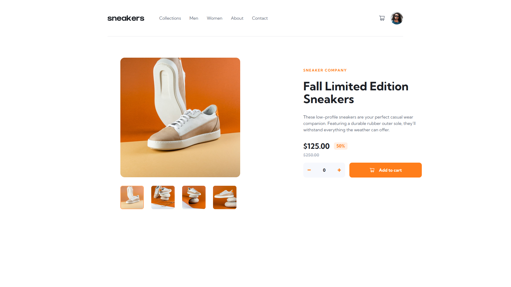

# e-commerce-product-page

  

# Getting Started

;

1. First of all you need to clone app repository from github:

```
https://github.com/Lazzzare/ecommerce-product-page
```

2. Next step requires install all the dependencies.

```
npm install
```

3. Running the Project

```
npm run dev
```

# Links

- Solution URL: [GitHub Code](https://github.com/Lazzzare/ecommerce-product-page)
- Live Site URL: [Live Site](https://ecommerce-product-page-lazzzare.vercel.app/)

# Built With

- _Vite_
- _React_
- _Typescript (TSX)_
- _TailwindCss_
- _sweetalert2_
- _React Hooks (useState, useEffect)_
- _framer-motion_
- _react-icons_
